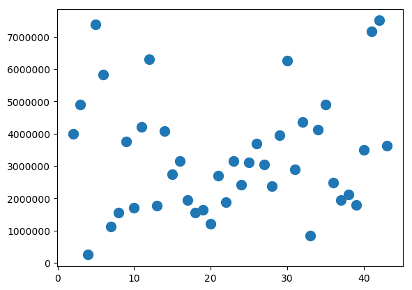

# Business Intelligence Elective

This is a repository for the assignments given in the Business Intelligence elective of the second semester of the top-up bachelor program in Software Development at CPHBusiness.

Assignment hand-ins displayed on this repository are group hand-ins for the group Disgusting Software, consisting of Emil Rosenius Pedersen and Nicolai Vikkelsø Bonderup.

# Assignment 1: Environment Setup and Introduction to Python

1. **List the all files that this program generates.**

The program generates two files: *price_list.csv* and *prices.png*.

2. **Describe which types of files this program generates and attach the contents of each file together with its name to your solution.**

The program outputs a .csv-file named **price_list.csv** containing the  following values
`street`, `city`, `price`, `sqm` and `price_per_sqm`. All of the values except for the
`price_per_sqm` are retrieved directly from the downloaded .txt-file named **price_list.txt**.
The `price_per_sqm` is calculated for each line by dividing the `price` field with the `sqm`
field of each line in the .txt-file.

The program also generates a scatter chart, drawing a single point for each point of data
in a series of `price_per_sqm` without connecting them. In essence, it shows the deviation
of square meter prices across different housing prices.

# Files:

## price_list.txt
Below is a preview of the downloaded `price_list.txt`-file, which is being downloaded from [an external location](https://raw.githubusercontent.com/datsoftlyngby/soft2017fall-business-intelligence-teaching-material/master/assignments/assignment_1/price_list.txt):

```
  ...
  * Ved Volden 5, 5. TV; 1425 København K	4000000	91
  * Rådhusstræde 4C, 1; 1466 København K	4895000	105
  * Store Kongensgade 112A, 3; 1264 København K	250000	135
  ...
```

## price_list.csv
Below is the CSV file, which is being created and written to by the Python script:

| street                          | city             | price   | sqm | price_per_sqm | 
|---------------------------------|------------------|---------|-----|---------------| 
| "Ved Volden 5, 5. TV"           | 1425 København K | 4000000 | 91  | 43956         | 
| "Rådhusstræde 4C, 1"            | 1466 København K | 4895000 | 105 | 46619         | 
| "Store Kongensgade 112A, 3"     | 1264 København K | 250000  | 135 | 1851          | 
| "Amaliegade 13G, 2"             | 1256 København K | 7375000 | 98  | 75255         | 
| "Borgergade 144, 3. TH"         | 1300 København K | 5825000 | 101 | 57673         | 
| "Nørre Søgade 9A, 1. TH"        | 1370 København K | 1126250 | 107 | 10525         | 
| "Wildersgade 22, ST"            | 1408 København K | 1556700 | 88  | 17689         | 
| "Toldbodgade 10A, 1"            | 1253 København K | 3750000 | 184 | 20380         | 
| "Andreas Bjørns Gade 4, 3. TH"  | 1428 København K | 1700000 | 54  | 31481         | 
| "Sølvgade 15, 4. TH"            | 1307 København K | 4215000 | 81  | 52037         | 
| "Linnésgade 16A, 1"             | 1361 København K | 6300000 | 155 | 40645         | 
| "Store Kongensgade 63A, ST. 4"  | 1264 København K | 1780000 | 98  | 18163         | 
| "Peder Skrams Gade 28, 2. TV"   | 1054 København K | 4080000 | 76  | 53684         | 
| "Brobergsgade 14, 1. TV"        | 1427 København K | 2750000 | 50  | 55000         | 
| "Sølvgade 13, 2. TV"            | 1307 København K | 3150000 | 73  | 43150         | 
| "Ny Adelgade 9, 2. TH"          | 1104 København K | 1950000 | 70  | 27857         | 
| "Lavendelstræde 9, 2. TV"       | 1462 København K | 1550000 | 66  | 23484         | 
| "Åbenrå 10, 2. 5"               | 1124 København K | 1650000 | 70  | 23571         | 
| "Grønnegade 31, 3. TV"          | 1107 København K | 1200000 | 49  | 24489         | 
| "Badstuestræde 16, 2"           | 1209 København K | 2700000 | 97  | 27835         | 
| "Nørre Voldgade 70, 4"          | 1358 København K | 1870000 | 99  | 18888         | 
| "Fredericiagade 25, 5. 1"       | 1310 København K | 3150000 | 118 | 26694         | 
| "Sølvgade 19, 2. MF"            | 1307 København K | 2425000 | 49  | 49489         | 
| "David Balfours Gade 3, ST. TV" | 1402 København K | 3100000 | 83  | 37349         | 
| "Vimmelskaftet 36A, 3. TH"      | 1161 København K | 3695000 | 84  | 43988         | 
| "Store Kongensgade 110C, 3. TV" | 1264 København K | 3050000 | 118 | 25847         | 
| "Andreas Bjørns Gade 10, 3. TV" | 1428 København K | 2367000 | 53  | 44660         | 
| "Grønnegade 31, 4"              | 1107 København K | 3950000 | 73  | 54109         | 
| "Peder Skrams Gade 27, 3. TH"   | 1054 København K | 6250000 | 112 | 55803         | 
| "Andreas Bjørns Gade 22, 3. TH" | 1428 København K | 2900000 | 55  | 52727         | 
| "Kronprinsessegade 10, 4. TV"   | 1306 København K | 4350000 | 101 | 43069         | 
| "Bartholinsgade 11, 1. TV"      | 1356 København K | 841000  | 52  | 16173         | 
| "Sankt Peders Stræde 17, 2"     | 1453 København K | 4125000 | 106 | 38915         | 
| "Ved Volden 11, 4. TH"          | 1425 København K | 4900000 | 97  | 50515         | 
| Luftmarinegade 38               | 1432 København K | 2485131 | 137 | 18139         | 
| "Gernersgade 5, ST. TV"         | 1319 København K | 1950000 | 37  | 52702         | 
| "Ahlefeldtsgade 26, 4. TV"      | 1359 København K | 2115000 | 82  | 25792         | 
| "Dronningens Tværgade 36, 4. 1" | 1302 København K | 1785000 | 82  | 21768         | 
| "Nikolajgade 20, 2. TV"         | 1068 København K | 3500000 | 92  | 38043         | 
| "Strandgade 12, 3"              | 1401 København K | 7170000 | 228 | 31447         | 
| "Store Kongensgade 90, 2. TH"   | 1264 København K | 7500000 | 158 | 47468         | 
| "Gothersgade 147, 3. TV"        | 1123 København K | 3622500 | 68  | 53272         | 

## prices.png
Below is the `.png`-file containing the scatter map which is being generated by the Python script.  


3. **What is the output of this program?**

The average price of every property on the price list, calculated by the `compute_avg_price()` method. The output of the method is `3307228.119047619`.

4. **Describe in natural language and line-by-line what the program is doing. Describe also for each line what the Python code expresses.**


As far as we understand, 'natural language' means something non-technical, so we've tried to dumb it down as much as possible.

```
# These are imports, similar to imports in other languages, bringing in libraries for use in the program.
import os
import csv
import requests
import platform
import statistics
import matplotlib
matplotlib.use('agg')
import matplotlib.pyplot as plt


# Defines a method named 'download_txt()'.
def download_txt(url, save_path='./downloaded'):
    # Uses the 'requests' HTTP library to get the price_list.txt file from the course's GitHub repository.
    response = requests.get(url)
    # 'With' takes the result of the open() call, and assigns the result to the variable 'f'.
    # open() opens up a file, and the 'wb' part tells it how it should open the file up.
    with open(save_path, 'wb') as f:
        # This part writes the content of the response we got earlier to the file we just opened up.
        f.write(response.content)


# Defines a method named 'generate_csv()'.
def generate_csv(txt_input_path, csv_output_path):
    # 'With' takes the result of the open() call, and assigns the result to the variable 'f'.
    # open() opens up a file, and the 'encoding' part tells it the format of the file it's opening.
    with open(txt_input_path, encoding='utf-8') as f:
        # Records the contents of the file into the variable 'txt_content'.
        txt_content = f.readlines()

    # Creates a variable with a list of words inside.
    rows = [['street', 'city', 'price', 'sqm', 'price_per_sqm']]
    # Repeats a block of code for every line present in the variable 'txt_content' from earlier.
    for line in txt_content:
        # Looks for lines where a space and asterisk symbol follow each other, then removes those instances.
        line = line.rstrip().replace('  * ', '')
        # Creates three new variables, filling them with data from the line, separated by tabs on the line.
        address, price, sqm = line.split('\t')
        # Creates two new variables, filling them with data from the line, separated by ';' characters on the line.
        street, city = address.split('; ')
        # Calculates the price per square meter of the given property.
        price_per_sqm = int(price) // int(sqm)
        # Creates a tuple, meaning a list of values separated by commas.
        row = (street, city, price, sqm, price_per_sqm)
        # Adds the tuple to the collection 'rows' that we defined earlier.
        rows.append(row)

    # Checks if the system this script is being run on is a Windows system.
    if platform.system() == 'Windows':
        # Sets a variable for later to fit with Windows' way of formatting a UTF-8 file.
        newline = ''
    else:
        # Sets a variable for later to fit with Unix's way of formatting a UTF-8 file.
        newline = None

    # 'With' takes the result of the open() call, and assigns the result to the variable 'f'.
    # open() opens up a file, and the 'w','newline' and 'encoding' parts tell it the format of the file it's opening.
    with open(csv_output_path, 'w', newline=newline, encoding='utf-8') as f:
        # Creates an object that allows for writing CSV-formatted files.
        output_writer = csv.writer(f)
        # Repeats a code block for every tuple in the 'rows' variable.
        for row in rows:
            # Writes every tuple to the file we opened earlier in the 'with' code.
            output_writer.writerow(row)


# Defines a method named 'read_prices()'.
def read_prices(csv_input_path):
    # 'With' takes the result of the open() call, and assigns the result to the variable 'f'.
    # open() opens up a file, and the 'encoding' part tells it the format of the file it's opening.
    with open(csv_input_path, encoding='utf-8') as f:
        # Creates an object that can read a CSV file.
        reader = csv.reader(f)
        # Creates a variable for seemingly disposable columns in the tuple.
        _ = next(reader)

        # Creates a collection for indexes.
        idxs = []
        # Creates a collection for prices.
        prices = []
        # Repeats a code block for row that the 'reader' object finds in the file we gave the 'open()' call.
        for row in reader:
            # Gets the different values from the tuple, adding the disposable columns to the '_' variable,
            # and then adding the price that we're interested in to the 'price' variable.
            _, _, price, _, _ = row
            # Adds an index for the price, defined by the line number of the row we're looking at.
            idxs.append(reader.line_num)
            # Converts the price to a different data type, and adds it to the 'prices' collection.
            prices.append(int(price))

    # Gives us a iterable list of tuples, made up of the prices and their indexes.
    return list(zip(idxs, prices))


# Defines a method named 'computer_avg_price()'.
def compute_avg_price(data):
    # Takes the tuples in the 'data' variable, disposes of the index in a bogus variable,
    # and adds the price to a 'price' variable.
    _, prices = zip(*data)
    # Uses the 'statistics' library to compute the mean of all prices in the collection.
    avg_price = statistics.mean(prices)

    # 'With' takes the result of the open() call, and assigns the result to the variable 'f'.
    # open() opens up a file, and the 'w' and 'encoding' parts tell it the format of the file it's opening.
    with open('/tmp/avg_price.txt', 'w', encoding='utf-8') as f:
        # Writes the mean of the prices to a file.
        f.write(str(avg_price))

    # Retuns the mean price to us.
    return avg_price


# Defines a method named 'generate_plot()'.
def generate_plot(data):
    # Assigns the prices and their indexes to x and y variables so they can be plotted on a graph.
    x_values, y_values = zip(*data)
    # Creates an object with the 'matplotlib' library that represents a graphical statistical figure.
    fig = plt.figure()
    # Creates a scatter plot with the prices and their indexes.
    plt.scatter(x_values, y_values, s=100)
    # Saves the scatter plot to a .png file.
    fig.savefig('./prices.png', bbox_inches='tight')


# Defines a method named 'run()'.
def run():
    # Puts the URL for the price list we need to calculate into a more easily usable variable.
    file_url = 'https://raw.githubusercontent.com/datsoftlyngby/' \
               'soft2017fall-business-intelligence-teaching-material/master/' \
               'assignments/assignment_1/price_list.txt'
    # Gets the base name of the path we defined above, which in this case is 'price_list.txt'.
    txt_file_name = os.path.basename(file_url)
    # Adds the text './' to the base name we grabbed above.
    txt_path = os.path.join('./', txt_file_name)
    # Runs the method 'download_txt' that we defined earlier, giving it the location of the file,
    # and where we want the file to be saved.
    download_txt(file_url, txt_path)
    # Defines the name we want for the CSV file we'll be generating.
    csv_file_name = 'price_list.csv'
    # Gets the path for the current working directory, which is where this script is being run from.
    csv_path = os.path.join(os.getcwd(), csv_file_name)
    # Generates a CSV file from the txt file we grabbed earlier, and saves it to the directory.
    generate_csv(txt_path, csv_path)
    # Reads the prices from the CSV file we made.
    data = read_prices(csv_path)
    # Calculates the mean of the prices we found earlier.
    avg_price = compute_avg_price(data)
    # Prints out the mean of the prices.
    print(avg_price)
    # Creates a scatter plot of the prices, and puts it into a .png file for us.
    generate_plot(data)


# Checks if this script is being run by itself, or if it's imported by a different script.
# If it's not imported, then call the 'run()' method.
if __name__ == '__main__':
    run()

```

